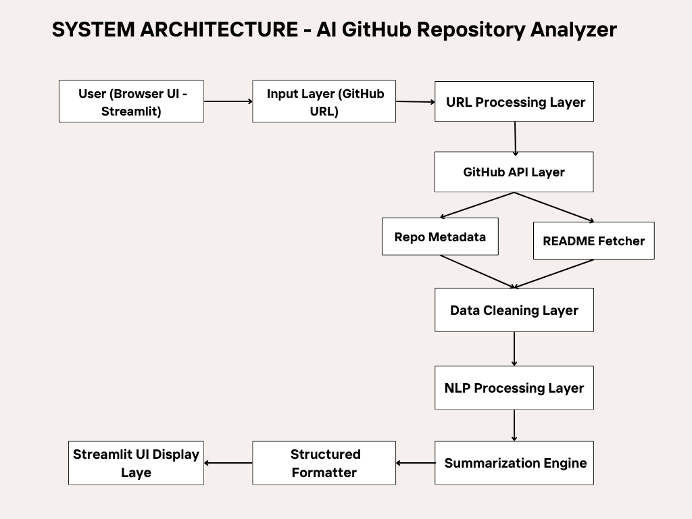
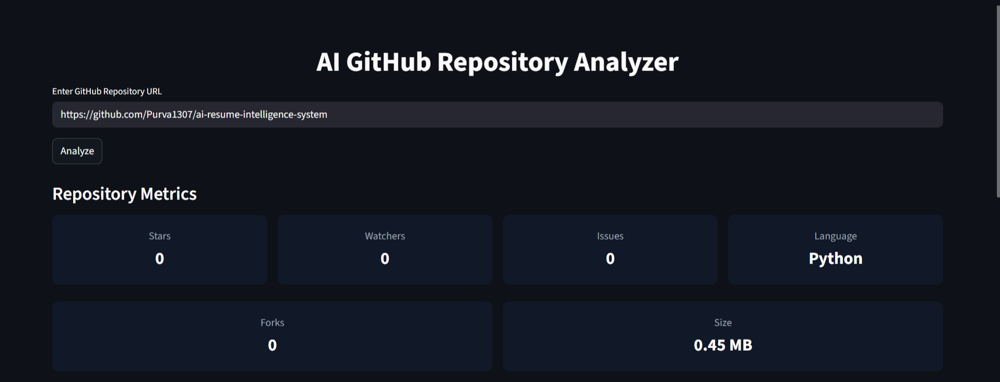

#  AI GitHub Repository Analyzer

---

##  Overview

**AI GitHub Repository Analyzer** is a web-based application that analyzes any public GitHub repository using its URL.

It automatically fetches repository data via GitHub API, processes the README using NLP techniques, and generates a structured summary along with key insights such as stars, forks, issues, and more.

---

##  Problem Statement

Understanding a GitHub repository often requires manually reading long and unstructured README files.

👉 This project solves that problem by:
- Extracting key information automatically  
- Generating structured summaries  
- Providing quick insights for developers and recruiters  

---

##  Features

- Analyze any GitHub repository using URL  
- Displays repository metrics (stars, forks, issues, etc.)  
- NLP-based README processing  
- Structured summary generation:
- Overview  
- Key Features  
- Purpose  
- Additional Info  
- Fast and lightweight (no heavy ML models)  
- Deployed on Streamlit Cloud  

---

##  System Architecture

  

---

##  Project Pipeline

  

---

##  Tech Stack

| Layer            | Technology Used              |
|------------------|----------------------------|
| Frontend         | Streamlit                  |
| Backend          | Python                     |
| API              | GitHub REST API            |
| NLP Processing   | Rule-based NLP, Regex      |
| Libraries        | requests, re               |
| Deployment       | Streamlit Cloud            |
| Version Control  | Git, GitHub                |

---

##  Application Preview

  

  

  

---

##  How It Works

1. User enters GitHub repository URL  
2. URL is parsed to extract owner and repository name  
3. GitHub API fetches repository metadata  
4. README file is extracted  
5. Text is cleaned and processed  
6. NLP logic extracts key information  
7. Structured summary is generated  
8. Output is displayed in the UI  

---

## Live Deployment

🔗 **Live App:**  

https://your-streamlit-app-link

⚠️ **Note:**  
This application is hosted on the free tier of Streamlit Cloud.  
If the app remains inactive for **13–15 minutes**, it goes to sleep.

When you open the app, you may see a **“Wake up app” button** —  
please click it and wait a few seconds for the app to start.

---

##  Sample Use Cases
- Developers exploring new repositories
- Recruiters reviewing candidate projects
- Students learning from open-source projects
- Hackathon participants analyzing repos quickly

---

##  Future Improvements
1. Integration of LLMs (GPT / Gemini) for smarter summarization
2. Repository quality scoring system
3. Advanced tech stack detection
4. Resume bullet point generator
5. Chat-based repository assistant
6. Caching for faster performance

---

## Author

Prateek Tiwari
B.Tech CSE
AI/ML Enthusiast
